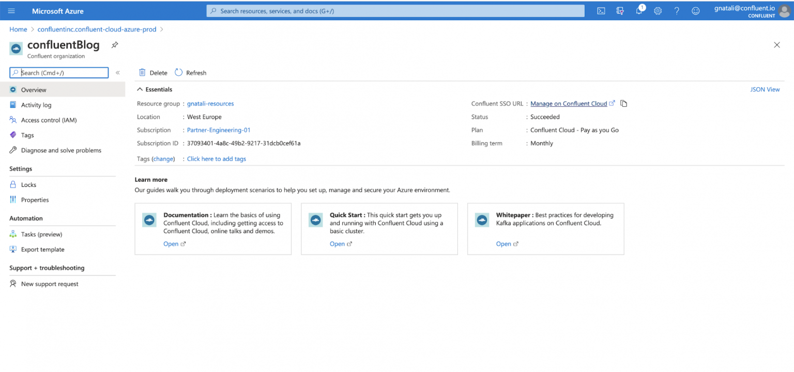
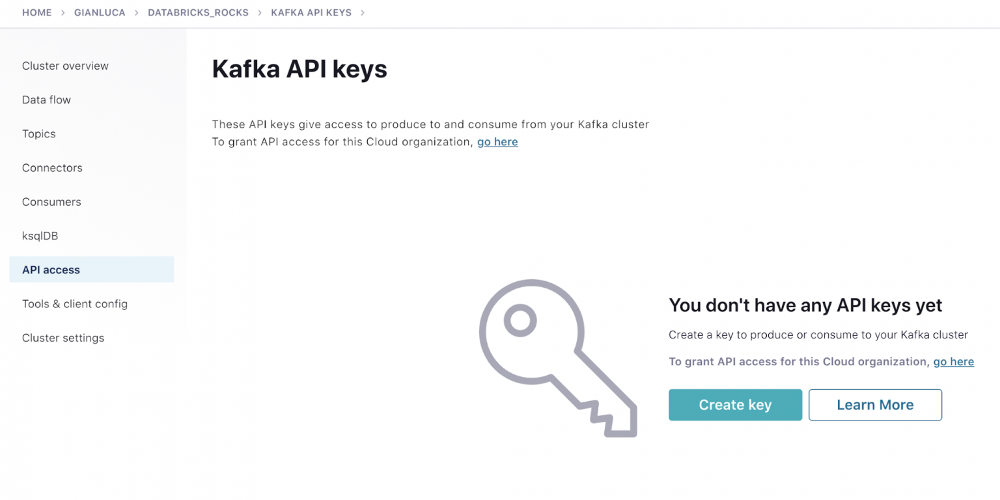
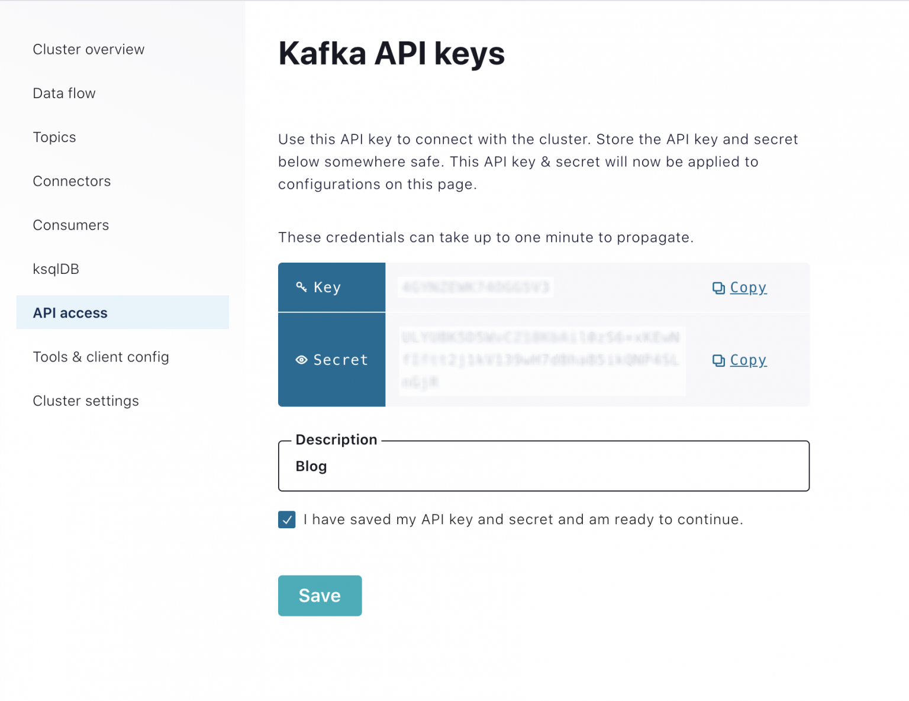
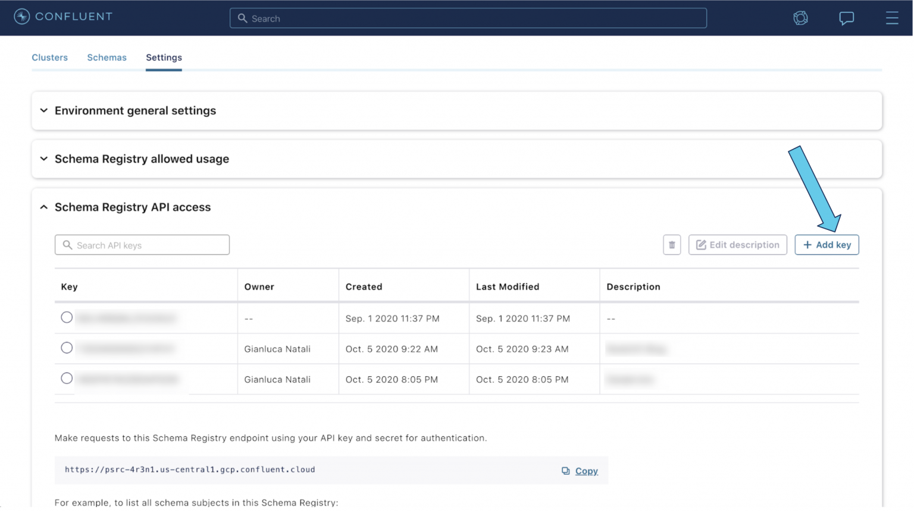

== Prepare the Confluent Cloud environment

=== Create a Kafka cluster

Sign in to the Azure portal and search for Confluent Cloud.

image::./images/search-confluent-cloud-1536x300.png[Search Confluent Cloud on Azure Marketplace]

If you already have a Confluent organization set up in Azure, you can use it, otherwise select *Apache Kafka® on Confluent Cloud™* under the “Marketplace” section.

image::./images/create-confluent-organization-1417x1536.png[Create Confluent Cloud Organization in Azure]

Choose your desired Subscription and Resource Group to host the Confluent organization, complete the mandatory fields, and then click *Review + create*. On the review page, click *Create*.

Wait for the deployment to complete and then click *Go to resource*. On the overview page, click the *Confluent SSO* link on the right.

Once you are redirected to Confluent Cloud, click the *Create cluster* button. Select the cluster type *Basic* and click *Begin Configuration*.

image::./images/select-cluster-type-1536x1328.png[Select Cluster Type]

Select an Azure region, then click *Continue*.

image::./images/select-region-timezone.png[Select Cluster Region and Availability type]

Specify a cluster name and click *Launch cluster*.

image::./images/review-and-launch-cluster-1536x1325.png[Review and launch cluster]

==== Create API keys for your Kafka cluster
Next, click the *API access* link on the left menu and click *Create key*.

Select *Create an API key associated with your account* and then select *Next*.

image::./images/create-api-key-1536x847.png[Create API key]

Copy the key and secret to a local file, and check *I have saved my API key and secret and am ready to continue*. You will need the key and secret later.

==== Create a topic
Return to your cluster. Click the *Topics* link in the left menu and click *Create topic*.

image::./images/create-a-topic-1536x695.png[Create a topic]

Type “{topicname}” as the topic name and select *Create with defaults*.

image::./images/new-topic-2-1024x639.png[New Topic]

=== Enable Schema Registry
To enable Schema Registry, go back to your environment page. Click the *Schemas* tab. Select *Azure*, choose a region, and click *Enable Schema Registry*.

image::./images/enable-schema-registry-1536x779.png[Enable Schema Registry]

==== Create Schema Registry API access key
Click on the *Settings* tab. Open the Schema Registry API access section, and click on the *Create key* button (or *Add Key* button if you already have some keys created).

Copy the key and secret, and make sure to write them down. Add a description for the key. Check the *I have saved my API keys* checkbox. Click *Continue*.

